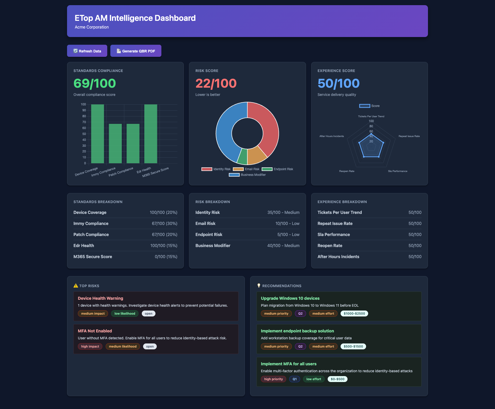

# ETop AM Intelligence System

A vendor-neutral Account Manager intelligence platform for MSPs that automates quarterly business reviews (QBRs), lifecycle planning, security posture reporting, and outcome planning.

## Screenshots

### Dashboard Overview


### Dashboard Hero Section


## Features

- **Multi-Vendor Data Integration**: Pulls data from ConnectWise Manage, Immy.Bot, and Microsoft 365
- **Normalized Data Model**: PostgreSQL database with vendor-agnostic schema
- **Three Composite Scores**: Standards Compliance, Risk, and Experience (each 0-100)
- **AI-Powered Narratives**: OpenAI GPT-4 generates business-focused QBR content with strict citation requirements
- **Automated QBR Generation**: 9-section PDF reports with scores, trends, risks, and recommendations
- **Adapter Pattern**: Easily add new integrations without modifying core engine

## Architecture

```
API Layer (Express) → Adapter Layer → Normalized DB (PostgreSQL)
         ↓
Insights Engine (Standards/Risk/Experience Scores)
         ↓
Output Layer (OpenAI Narrative + PDFKit)
         ↓
Job Queue (pg-boss)
```

## Prerequisites

- Node.js 20 LTS or higher
- PostgreSQL 15+
- API credentials for:
  - ConnectWise Manage
  - Immy.Bot
  - Microsoft 365 (tenant with Graph API access)
  - OpenAI (GPT-4 access recommended)

## Installation

1. Clone the repository:
```bash
cd /Users/name/homelab/etop-am-system-1282
```

2. Install dependencies:
```bash
npm install
```

3. Configure environment variables:
```bash
cp .env.example .env
# Edit .env with your credentials
```

4. Run database migrations:
```bash
npm run migrate:latest
```

5. Start the server:
```bash
npm start
```

6. Start the worker (in separate terminal):
```bash
npm run worker
```

## Environment Variables

See `.env.example` for all required configuration. Key variables:

- `DATABASE_URL`: PostgreSQL connection string
- `API_KEY`: API key for authentication
- `CW_*`: ConnectWise Manage credentials
- `IMMY_*`: Immy.Bot credentials
- `M365_*`: Microsoft 365 credentials
- `OPENAI_API_KEY`: OpenAI API key

## API Endpoints

### Health Check
```bash
GET /health
```

### Sync Data
```bash
POST /sync/connectwise
POST /sync/immy
POST /sync/m365
```

### Get Scores
```bash
GET /clients/:id/scores
```

### Generate QBR
```bash
POST /clients/:id/qbr/generate
GET /clients/:id/qbr/:jobId
```

## Usage Example

1. **Sync data from all three sources**:
```bash
curl -X POST http://localhost:3000/sync/connectwise \
  -H "Authorization: Bearer your-api-key"

curl -X POST http://localhost:3000/sync/immy \
  -H "Authorization: Bearer your-api-key"

curl -X POST http://localhost:3000/sync/m365 \
  -H "Authorization: Bearer your-api-key"
```

2. **Calculate scores**:
```bash
curl http://localhost:3000/clients/1/scores \
  -H "Authorization: Bearer your-api-key"
```

3. **Generate QBR**:
```bash
curl -X POST http://localhost:3000/clients/1/qbr/generate \
  -H "Authorization: Bearer your-api-key" \
  -H "Content-Type: application/json"
```

4. **Check QBR status**:
```bash
curl http://localhost:3000/clients/1/qbr/{job-id} \
  -H "Authorization: Bearer your-api-key"
```

## Scoring Formulas

### Standards Compliance (0-100)
- Device coverage: 20%
- Immy compliance: 30%
- Patch compliance: 20%
- EDR health: 15%
- M365 Secure Score: 15%

### Risk Score (0-100, higher = more risk)
- Identity risk: 30%
- Email risk: 25%
- Endpoint risk: 25%
- Business modifier: 20%

### Experience Score (0-100)
- Tickets per user trend: 25%
- Repeat issue rate: 20%
- SLA performance: 25%
- Reopen rate: 15%
- After-hours incidents: 15%

## Development

### Run Tests
```bash
npm test
```

### Run Migrations
```bash
# Create new migration
npm run migrate:make migration_name

# Run migrations
npm run migrate:latest

# Rollback migrations
npm run migrate:rollback
```

## Project Structure

```
src/
├── adapters/          # Vendor integrations (ConnectWise, Immy, M365)
├── engine/            # Scoring algorithms
├── qbr/               # Narrative and PDF generation
├── routes/            # API endpoints
├── models/            # Database query helpers
├── middleware/        # Auth, validation, error handling
├── utils/             # Logger, cache
├── db/                # Knex config and migrations
├── app.js             # Express app setup
├── server.js          # HTTP server
└── worker.js          # Background job processor
```

## License

ISC

## Support

For issues and questions, please contact your system administrator.
